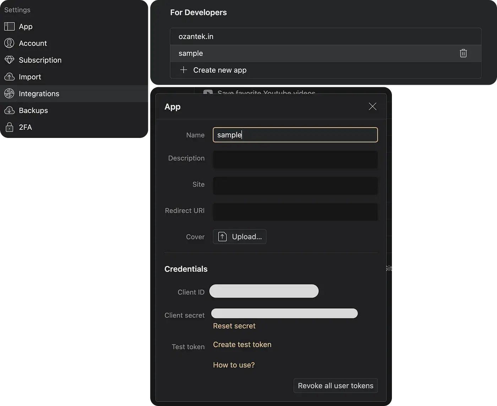
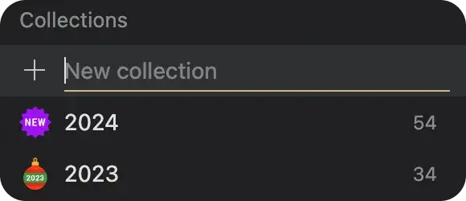

This tutorial is backed by open source code. Find the complete source code in our [GitHub repository](https://github.com/SHSFWork/raindrop-nextjs-bookmark-starter-kit). The code is open source and available for everyone to use.

## Headings

- How to Generate a Raindrop Access Token?
- How to Create Collections?
- How to Write a GET Service for Collections?
- How to Write a GET Service for Bookmarks?
- How to Integrate Services into the UI?

## 1. How to Generate a Raindrop Access Token

First, create a Raindrop account if you don't have one.

Navigate to the settings by clicking on your user information in the upper-right corner. Go to the "Integrations" section. Under the "For developers" area, create a new app and generate a test token.

This token will be used shortly in our environment configuration.



## 2. How to Create Collections

On the main page, use the plus button next to the collections menu to quickly create a new collection.



## 3. How to Write a GET Service for Collections

Add your access token to your environment variables file. Create a .env file at the root of your project and add:

```env
NEXT_PUBLIC_RAINDROP_ACCESS_TOKEN=[your access token]
```

Next, create a lib directory and add a raindrop.tsx file:

```typescript
import "server-only";
import { cache } from "react";

const options = {
  method: "GET",
  headers: {
    "Content-Type": "application/json",
    Authorization: `Bearer ${process.env.NEXT_PUBLIC_RAINDROP_ACCESS_TOKEN}`,
  },
};

const RAINDROP_API_URL = "https://api.raindrop.io/rest/v1";
export const getCollections = cache(async () => {
  try {
    const response = await fetch(`${RAINDROP_API_URL}/collections`, options);
    const collections = await response.json();
    return collections;
  } catch (error) {
    console.info(error);
    return null;
  }
});
```

This function fetches your collections without their bookmarks.

## 4. How to Write a GET Service for Bookmarks

To fetch bookmarks within a collection, extend the raindrop.tsx file:

```typescript
export const getBookmark = cache(async (id: number, pageIndex = "0") => {
  try {
    const response = await fetch(
      `${RAINDROP_API_URL}/raindrops/${id}?` +
        new URLSearchParams({
          page: pageIndex,
          perpage: "100",
        }),
      options
    );
    return await response.json();
  } catch (error) {
    console.info(error);
    return null;
  }
});
```

This function retrieves bookmarks for a specific collection.

## 5. How to Integrate Services into the UI

Create the main page component under the pages directory:

```typescript
import { getBookmark, getCollections } from "@ozantekin/libs/raindrop";
import MainPage from "@ozantekin/modules/MainPage";

export const dynamic = "force-dynamic";

async function Home() {
  const [bookmark, collections] = await Promise.all([
    getBookmark(0),
    getCollections(),
  ]);
  return <MainPage bookmark={bookmark} collections={collections} />;
}

export default Home;
```

Next, create the MainPage component under the modules directory:

```typescript
"use client";

import Link from "next/link";

interface MainPageProps {
  bookmark: BookmarkProps;
  collections: CollectionsProps;
}

function MainPage({ bookmark, collections }: MainPageProps) {
  return (
    <main className="grid grid-cols-4 gap-4 p-4">
      {bookmark.items.map((item: any) => {
        return (
          <div
            key={item.id}
            className="max-w-sm bg-white border border-gray-200 rounded-lg shadow "
          >
            

            <div className="p-5 space-y-2">
              <h5 className="mb-2 text-2xl font-bold tracking-tight text-gray-900 ">
                {item.title}
              </h5>

              <p className="mb-3 font-normal text-gray-700 ">{item.excerpt}</p>
              <p className="text-xs text-gray-400"> {item.domain} </p>
              <Link
                href={item.link}
                target="_blank"
                className="inline-flex items-center px-3 py-2 text-sm font-medium text-center text-white bg-orange-500 rounded-lg hover:bg-orange-600 focus:ring-4 focus:outline-none focus:ring-orange-300 "
              >
                Go to bookmark
                <svg
                  className="rtl:rotate-180 w-3.5 h-3.5 ms-2"
                  aria-hidden="true"
                  xmlns="http://www.w3.org/2000/svg"
                  fill="none"
                  viewBox="0 0 14 10"
                >
                  <path
                    stroke="currentColor"
                    stroke-linecap="round"
                    stroke-linejoin="round"
                    stroke-width="2"
                    d="M1 5h12m0 0L9 1m4 4L9 9"
                  />
                </svg>
              </Link>
            </div>
          </div>
        );
      })}
    </main>
  );
}

export default MainPage;
```
