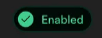
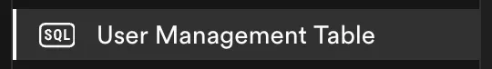

This comprehensive guide will walk you through integrating Google login functionality into your Next.js application using Supabase Auth. We'll break down this seemingly complex process into simple, understandable steps.

This tutorial is based on an [open-source repository](https://github.com/shsfwork/supabase-auth-nextjs-google-boilerplate), so you can follow along, explore the code, and even contribute.

## What You'll Learn

- Setting up Supabase and Google OAuth integration
- Implementing secure authentication on both client and server sides
- Protecting routes effectively with Next.js middleware
- Accessing user information in React components
- Managing user profiles with Supabase SQL Editor

---

### Creating a Supabase Project

- Log in to the [Supabase Dashboard](https://app.supabase.io/)
- Click on "New project"
- Give your project a meaningful name, create a strong database password, and select the region
- Click "Create new project" to initialize your project

#### Google Cloud OAuth Configuration

**Preparing Your Google Cloud Project**

1. Sign in to the [Google Cloud Console](https://console.cloud.google.com/)
2. Create a new project (from the project selector in the top right)
3. Navigate to ["APIs & Services > OAuth consent screen"](https://console.cloud.google.com/auth/overview) and click "Get Started"
4. Fill in the required fields (application name, user support email, etc.)
5. Select "External" as the application type and continue

**Creating an OAuth Client ID**

1. Go to "APIs & Services > Credentials"
2. Select "Create Credentials" > "OAuth client ID"
3. Enter the following information correctly:
   - **Application Type:** Web application
   - **Name:** A descriptive name for your Google OAuth integration
   - **Authorized JavaScript origins:** `http://localhost:3000` (for development)
   - **Authorized Redirect URIs:** The callback URL from your Supabase dashboard (we'll get this in the next step)

> ⚠️ Caution: Remember to update these URLs with your actual domain when moving to production!

#### Enabling Google Sign-In in Supabase

1. In your Supabase project dashboard, go to "Authentication > Providers"
2. Find Google and enable "Sign In with Google"
3. Paste the Client ID and Client Secret from your Google Cloud Console



#### Setting Up the Redirect URL

1. Go to ["Authentication > URL Configuration"](https://supabase.com/dashboard/project/_/auth/url-configuration)
2. Add `http://localhost:3000/\*\*` to the Redirect URLs field (for development)

> 💡 Tip: Using the wildcard (\*\*) allows subpaths to be used for redirection as well.

---

### Creating and Configuring a Next.js Project

**Setting Up a New Project**

```bash
npx create-next-app@latest
```

**Installing Required Packages**

```bash
# Core packages for Supabase integration
npm install @supabase/supabase-js @supabase/ssr

# Helper packages for client/server isolation
npm install client-only server-only

# Icon packages
npx shadcn@latest init
npm install lucide-react
```

---

### Setting Environment Variables

Create a `.env.local` file in your project root directory and add the following variables:

```bash
NEXT_PUBLIC_SUPABASE_URL=your_supabase_project_url
NEXT_PUBLIC_SUPABASE_ANON_KEY=your_supabase_anon_key
SUPABASE_JWT_SECRET=your_supabase_jwt_secret
```

> ⚠️ Reminder: You can find these values in the "Project Settings > API" section of your Supabase control panel.

---

### Configuring Supabase Clients

We need two clients to communicate with Supabase on the client and server sides.

**Supabase Client for Client-Side**

Create a `lib/supabase/client.ts` file:

```ts
import "client-only";

import { createBrowserClient } from "@supabase/ssr";

export default function createClient() {
  return createBrowserClient(
    process.env.NEXT_PUBLIC_SUPABASE_URL!,
    process.env.NEXT_PUBLIC_SUPABASE_ANON_KEY!
  );
}
```

**Supabase Client for Server-Side**

Create a `lib/supabase/server.ts` file:

```ts
import "server-only";
import { cookies } from "next/headers";
import { createServerClient } from "@supabase/ssr";

export default async function createClient() {
  const cookieStore = await cookies();

  return createServerClient(
    process.env.NEXT_PUBLIC_SUPABASE_URL!,
    process.env.NEXT_PUBLIC_SUPABASE_ANON_KEY!,
    {
      cookies: {
        getAll: () => cookieStore.getAll(),

        setAll: (cookiesToSet) => {
          try {
            cookiesToSet.forEach(({ name, value, options }) =>
              cookieStore.set(name, value, options)
            );
          } catch {
             if called from a Server Component
          }
        },
      },
    }
  );
}
```

> 💡 Why Two Different Clients?: The React Server Components architecture requires different working principles for client and server components. Using specialized clients for each environment is important for both security and performance.

---

### Route Protection with Middleware

Next.js middleware consists of code that runs before HTTP requests are completed, making it an excellent solution for authentication.

Create a `lib/supabase/middleware.ts` file:

```ts
import { NextResponse, type NextRequest } from "next/server";
import { createServerClient } from "@supabase/ssr";
import { LOGIN_PATH } from "@/constants/common";

export default async function updateSession(request: NextRequest) {
  let supabaseResponse = NextResponse.next({ request });

  // Initialize Supabase server client with custom cookie handling
  const supabase = createServerClient(
    process.env.NEXT_PUBLIC_SUPABASE_URL!,
    process.env.NEXT_PUBLIC_SUPABASE_ANON_KEY!,
    {
      cookies: {
        getAll: () => request.cookies.getAll(),
        setAll: (cookiesToSet) => {
          cookiesToSet.forEach(({ name, value }) =>
            request.cookies.set(name, value)
          );

          -create the response with updated cookies
          supabaseResponse = NextResponse.next({ request });

          cookiesToSet.forEach(({ name, value, options }) =>
            supabaseResponse.cookies.set(name, value, options)
          );
        },
      },
    }
  );

  // Fetch the current authenticated user
  const {
    data: { user },
  } = await supabase.auth.getUser();

  const path = request.nextUrl.pathname;

  // Redirect unauthenticated users to login, except for auth routes
  if (!user && !path.startsWith(LOGIN_PATH) && !path.startsWith("/auth")) {
    const url = request.nextUrl.clone();
    url.pathname = LOGIN_PATH;
    url.searchParams.set("next", path);
    return NextResponse.redirect(url);
  }

  // Prevent authenticated users from accessing the login page
  if (user && path.startsWith(LOGIN_PATH)) {
    const url = request.nextUrl.clone();
    url.pathname = "/";
    return NextResponse.redirect(url);
  }

  return supabaseResponse;
}
```

Then, create a `middleware.ts` file in your project root:

```ts
import { type NextRequest } from "next/server";

import updateSession from "@/lib/supabase/middleware";

export async function middleware(request: NextRequest) {
  return await updateSession(request);
}

export const config = {
  matcher: ["/profile", "/login"],
};
```

> 💡 Tip: The matcher array allows your middleware to run only on specific routes. This reduces unnecessary processing load and improves your application's performance.

### Creating a User Table

Run the following SQL commands in the Supabase SQL Editor:

```sql
-- User table linked to auth.users
CREATE TABLE public.users (
  id UUID PRIMARY KEY REFERENCES auth.users(id) NOT NULL,
  name TEXT NOT NULL,
  email TEXT NOT NULL UNIQUE
);

-- Trigger to insert user metadata into public.users after signup
CREATE OR REPLACE FUNCTION public.create_new_user()
RETURNS TRIGGER AS $$
BEGIN
  INSERT INTO public.users (id, name, email)
  VALUES (
    NEW.id,
    NEW.raw_user_meta_data->>'full_name',
    NEW.email
  );
  RETURN NEW;
END;
$$ LANGUAGE plpgsql SECURITY DEFINER;

-- Automatically run create_new_user() after a new auth.users insert
CREATE TRIGGER on_auth_user_created
  AFTER INSERT ON auth.users
  FOR EACH ROW
  EXECUTE FUNCTION public.create_new_user();

-- Enable Row-Level Security on public.users
ALTER TABLE public.users ENABLE ROW LEVEL SECURITY;
```

> ⚠️ Why RLS?: Row Level Security (RLS) is a powerful security mechanism that ensures users can only access their own data. It allows you to control data access at the database level.



### Creating an Auth Callback Handler

Let's create a route handler in Next.js App Router to manage the OAuth callback process, `app/auth/callback/route.ts:`

```ts
import { NextResponse } from "next/server";
import createClient from "@/lib/supabase/server";

export async function GET(request: Request) {
  const { searchParams, origin } = new URL(request.url);

  // Extract auth code and optional redirect path
  const code = searchParams.get("code");
  const next = searchParams.get("next") ?? "/";

  if (code) {
    const supabase = await createClient();

    // Exchange the auth code for a session
    const { error } = await supabase.auth.exchangeCodeForSession(code);

    if (!error) {
      // Redirect to the intended path or fallback to homepage
      return NextResponse.redirect(`${origin}${next}`);
    }
  }

  // Redirect to error page if code is missing or exchange fails
  return NextResponse.redirect(`${origin}/auth/auth-code-error`);
}
```

> ⚠️ Critical Point: This handler completes the authentication process by converting the OAuth code from Google to a Supabase session. It uses the "next" parameter to direct users to the correct page.

### Accessing User Data with useUser Hook

Let's create a hook to simplify access to user data in client components, `hooks/useUser.ts`:

```ts
import { useEffect, useState } from "react";

import { AuthError, Session, User } from "@supabase/supabase-js";

import createClient from "@/lib/supabase/client";

export default function useUser() {
  const [user, setUser] = useState<User | null>(null);
  const [session, setSession] = useState<Session | null>(null);
  const [loading, setLoading] = useState(true);
  const [error, setError] = useState<AuthError | null>(null);
  const supabase = createClient();

  useEffect(() => {
    async function fetchUser() {
      try {
        const {
          data: { session },
          error,
        } = await supabase.auth.getSession();
        if (error) throw error;

        if (session) {
          setSession(session);
          setUser(session.user);
        }
      } catch (error) {
        setError(error as AuthError);
      } finally {
        setLoading(false);
      }
    }
    fetchUser();
  }, [supabase]);

  return { loading, error, session, user };
}
```

> 💡 Hook Advantage: This hook helps you avoid code duplication when tracking user state across multiple components.

---

### Creating UI Components

`components/nav.tsx:`

```tsx
import Link from "next/link";

import { Menu, Sparkle } from "lucide-react";

import { Button } from "@/components/ui/button";
import {
  NavigationMenu,
  NavigationMenuItem,
  NavigationMenuLink,
  NavigationMenuList,
} from "@/components/ui/navigation-menu";
import {
  Sheet,
  SheetContent,
  SheetHeader,
  SheetTitle,
  SheetTrigger,
} from "@/components/ui/sheet";

import AuthButton from "@/components/auth-buttons";

interface MenuItem {
  title: string;
  url: string;
}

const NAV_MENU_ITEMS: MenuItem[] = [
  { title: "Home", url: "/" },
  {
    title: "Client",
    url: "/client",
  },
  {
    title: "Server",
    url: "/server",
  },
  {
    title: "Profile",
    url: "/profile",
  },
];

export default function Nav() {
  return (
    <section className="p-4 border-b">
      <div className="container mx-auto">
        {/* Desktop Menu */}
        <nav className="hidden justify-between lg:flex">
          <div className="flex items-center gap-6">
            <Logo  className="flex items-center">
              <NavigationMenu>
                <NavigationMenuList>
                  {NAV_MENU_ITEMS.map((item) => renderMenuItem(item))}
                </NavigationMenuList>
              </NavigationMenu>
            </div>
          </div>

          <AuthButton        </nav>

        {/* Mobile Menu */}
        <div className="block lg:hidden">
          <div className="flex items-center justify-between">
            <Logo         <Sheet>
              <SheetTrigger asChild>
                <Button variant="outline" size="icon">
                  <Menu className="size-4"             </Button>
              </SheetTrigger>
              <SheetContent className="overflow-y-auto">
                <SheetHeader>
                  <SheetTitle>
                    <Logo           </SheetTitle>
                </SheetHeader>
                <div className="flex flex-col gap-6 p-4">
                  {NAV_MENU_ITEMS.map((item) => renderMobileMenuItem(item))}

                  <AuthButton                </div>
              </SheetContent>
            </Sheet>
          </div>
        </div>
      </div>
    </section>
  );
}

const Logo = () => {
  return (
    <Link href="/" className="flex items-center gap-2">
      <Sparkle className="size-5"     <span className="text-lg font-semibold tracking-tighter">SHSF</span>
    </Link>
  );
};

const renderMenuItem = (item: MenuItem) => {
  return (
    <NavigationMenuItem key={item.title}>
      <NavigationMenuLink
        href={item.url}
        className="group inline-flex h-10 w-max items-center justify-center rounded-md bg-background px-4 py-2 text-sm font-medium transition-colors hover:bg-muted hover:text-accent-foreground"
      >
        {item.title}
      </NavigationMenuLink>
    </NavigationMenuItem>
  );
};

const renderMobileMenuItem = (item: MenuItem) => {
  return (
    <Link key={item.title} href={item.url} className="text-md font-semibold">
      {item.title}
    </Link>
  );
};
```

`components/auth-button.tsx:`

```tsx
"use client";

import Link from "next/link";
import { usePathname, useRouter } from "next/navigation";

import { Button } from "@/components/ui/button";

import createClient from "@/lib/supabase/client";

import { LOGIN_PATH } from "@/constants/common";
import { ArrowRightIcon, LogOut } from "lucide-react";
import useUser from "@/hooks/useUser";

export default function AuthButton() {
  const { user, loading } = useUser();
  const pathname = usePathname();
  const router = useRouter();
  const supabase = createClient();

  if (pathname === LOGIN_PATH) return null;

  const handleLogout = async () => {
    await supabase.auth.signOut();
    router.push(LOGIN_PATH);
    router.refresh();
  };

  if (loading) return null;

  if (user) {
    return (
      <Button variant="destructive" onClick={handleLogout}>
        <span>Logout</span>
        <LogOut className="opacity-60" size={16} aria-hidden="true"   </Button>
    );
  }

  return (
    <Button className="group" asChild>
      <Link href={LOGIN_PATH}>
        <span>Login</span>
        <ArrowRightIcon
          className="opacity-60 transition-transform group-hover:translate-x-0.5"
          size={16}
          aria-hidden="true"
            </Link>
    </Button>
  );
}
```

---

### Creating Base Layout and Pages

`app/layout.tsx:`

```tsx
import type { Metadata } from "next";
import { Geist, Geist_Mono } from "next/font/google";

import Nav from "@/components/nav";

import "./globals.css";

const geistSans = Geist({
  variable: "--font-geist-sans",
  subsets: ["latin"],
});

const geistMono = Geist_Mono({
  variable: "--font-geist-mono",
  subsets: ["latin"],
});

export const metadata: Metadata = {
  title: "Create Next App",
  description: "Generated by create next app",
};

export default function RootLayout({
  children,
}: Readonly<{
  children: React.ReactNode;
}>) {
  return (
    <html lang="en">
      <body
        className={`${geistSans.variable} ${geistMono.variable} antialiased`}
      >
        <Nav       <main className="px-4 py-8">{children}</main>
      </body>
    </html>
  );
}
```

`app/page.tsx:`

```tsx
export default function HomePage() {
  return (
    <section className="max-w-4xl mx-auto">
      <h1 className="text-2xl font-semibold">Welcome home!</h1>
      <p className="mt-2 text-muted-foreground">
        This is the main landing page of our application.
      </p>
    </section>
  );
}
```

`app/(playground)/client/page.tsx:`

```tsx
"use client";

import {
  Card,
  CardContent,
  CardDescription,
  CardHeader,
  CardTitle,
} from "@/components/ui/card";

import useUser from "@/hooks/useUser";
import { LoaderCircle } from "lucide-react";

export default function ClientPage() {
  const { loading, error, user } = useUser();

  if (loading) {
    return (
      <div className="flex items-center space-x-2 text-gray-500">
        <LoaderCircle className="animate-spin size-5"       <span>Loading user data...</span>
      </div>
    );
  }

  if (error) {
    return (
      <div className="p-4 bg-red-50 border border-red-200 rounded-md text-red-600">
        <p>Error: {error.message}</p>
      </div>
    );
  }

  return (
    <section className="max-w-4xl mx-auto">
      <Card>
        <CardHeader>
          <CardTitle>User Information</CardTitle>
          <CardDescription>
            User details fetched from the client
          </CardDescription>
        </CardHeader>
        <CardContent>
          <p>
            <span className="font-medium">Email:</span>{" "}
            {user?.email || "Not authenticated"}
          </p>
        </CardContent>
      </Card>
    </section>
  );
}
```

`app/(playground)/server/page.tsx:`

```tsx
import {
  Card,
  CardContent,
  CardDescription,
  CardHeader,
  CardTitle,
} from "@/components/ui/card";

import createClient from "@/lib/supabase/server";

export default async function ServerPage() {
  const supabase = await createClient();
  const {
    data: { user },
  } = await supabase.auth.getUser();

  return (
    <section className="max-w-4xl mx-auto">
      <Card>
        <CardHeader>
          <CardTitle>User Information</CardTitle>
          <CardDescription>
            User details fetched from the server
          </CardDescription>
        </CardHeader>
        <CardContent>
          <p className="text-gray-700">
            <span className="font-medium">Email:</span>{" "}
            {user?.email || "Not authenticated"}
          </p>
        </CardContent>
      </Card>
    </section>
  );
}
```

`app/(playground)/profile/page.tsx:`

```tsx
import { Avatar, AvatarFallback, AvatarImage } from "@/components/ui/avatar";
import { Card, CardContent, CardHeader, CardTitle } from "@/components/ui/card";

import createClient from "@/lib/supabase/server";
import { UserResponse } from "@supabase/supabase-js";

export default async function ProfilePage() {
  const supabase = await createClient();

  const { data }: UserResponse = await supabase.auth.getUser();
  const user = data.user;

  if (!user) return null;

  const displayEmail = user.email || "No email available";
  const userInitial = user.email ? user.email[0].toUpperCase() : "U";

  return (
    <section className="max-w-4xl mx-auto space-y-4">
      <Card>
        <CardHeader>
          <CardTitle>Profile</CardTitle>
        </CardHeader>
        <CardContent className="space-y-2">
          <Avatar>
            <AvatarImage
              src={user.user_metadata.avatar_url}
              alt={user.user_metadata.full_name}
            <AvatarFallback>{userInitial}</AvatarFallback>
          </Avatar>

          <p className="text-foreground truncate text-sm font-medium">
            {user.user_metadata?.full_name || "User"}
          </p>
          <p className="text-muted-foreground truncate text-xs font-normal">
            {displayEmail}
          </p>
        </CardContent>
      </Card>
    </section>
  );
}
```

`app/auth/login/page.tsx:`

```tsx
"use client";

import { useState } from "react";

import { useSearchParams } from "next/navigation";

import createClient from "@/lib/supabase/client";
import { CircleAlert, LoaderCircle } from "lucide-react";
import { Button } from "@/components/ui/button";

export default function LoginPage() {
  const [isGoogleLoading, setIsGoogleLoading] = useState<boolean>(false);
  const [error, setError] = useState<string | null>(null);

  const supabase = createClient();

  const searchParams = useSearchParams();
  const next = searchParams.get("next");

  const loginWithGoogle = async () => {
    setIsGoogleLoading(true);
    setError(null);

    try {
      const { error } = await supabase.auth.signInWithOAuth({
        provider: "google",
        options: {
          redirectTo: `${window.location.origin}/auth/callback${
            next ? `?next=${encodeURIComponent(next)}` : ""
          }`,
        },
      });

      if (error) {
        throw error;
      }
    } catch (error) {
      setError("There was an error logging in with Google. Please try again.");
      console.error("Error loging in with Google:", error);
      setIsGoogleLoading(false);
    }
  };

  return (
    <div className="max-w-md mx-auto py-12">
      <div className="text-center mb-8">
        <h1 className="text-2xl font-semibold">Welcome back</h1>
        <p className="mt-2 text-muted-foreground">
          Login to your account to continue
        </p>
      </div>

      {error && (
        <div className="rounded-md border px-4 py-3">
          <p className="text-sm">
            <CircleAlert
              className="me-3 -mt-0.5 inline-flex text-red-500"
              size={16}
              aria-hidden="true"

            {error}
          </p>
        </div>
      )}

      <Button
        variant="outline"
        className="w-full"
        onClick={loginWithGoogle}
        disabled={isGoogleLoading}
      >
        {isGoogleLoading ? (
          <LoaderCircle className="animate-spin size-5"       ) : (
          <GoogleIcon       )}
        <span className="ml-2">Login with Google</span>
      </Button>
    </div>
  );
}

const GoogleIcon = () => (
  <svg
    aria-hidden="true"
    focusable="false"
    role="img"
    xmlns="http://www.w3.org/2000/svg"
    viewBox="0 0 48 48"
    className="size-5"
  >
    <path
      fill="#fbc02d"
      d="M43.611,20.083H42V20H24v8h11.303c-1.649,4.657-6.08,8-11.303,8c-6.627,0-12-5.373-12-12 s5.373-12,12-12c3.059,0,5.842,1.154,7.961,3.039l5.657-5.657C34.046,6.053,29.268,4,24,4C12.955,4,4,12.955,4,24s8.955,20,20,20 s20-8.955,20-20C44,22.659,43.862,21.35,43.611,20.083z"
       <path
      fill="#e53935"
      d="M6.306,14.691l6.571,4.819C14.655,15.108,18.961,12,24,12c3.059,0,5.842,1.154,7.961,3.039 l5.657-5.657C34.046,6.053,29.268,4,24,4C16.318,4,9.656,8.337,6.306,14.691z"
       <path
      fill="#4caf50"
      d="M24,44c5.166,0,9.86-1.977,13.409-5.192l-6.19-5.238C29.211,35.091,26.715,36,24,36 c-5.202,0-9.619-3.317-11.283-7.946l-6.522,5.025C9.505,39.556,16.227,44,24,44z"
       <path
      fill="#1565c0"
      d="M43.611,20.083L43.595,20L42,20H24v8h11.303c-0.792,2.237-2.231,4.166-4.087,5.571 c0.001-0.001,0.002-0.001,0.003-0.002l6.19,5.238C36.971,39.205,44,34,44,24C44,22.659,43.862,21.35,43.611,20.083z"
     </svg>
);
```

> 💡 Redirection Tip: The "next" parameter used in the login page ensures that users are automatically redirected to their original destination after logging in. This significantly improves the user experience.

---

### Conclusion

This guide has thoroughly explained every step required to integrate Google OAuth into your Next.js application. By understanding how each component functions and interacts with the others, you'll be better equipped to tailor your authentication solution.

❇️ See the source code on [GitHub](https://github.com/shsfwork/supabase-auth-nextjs-google-boilerplate).

**Reminder Notes:**

- Remember to update all URLs with your actual domain before moving to production
- Never add your `.env.local` file to version control (add it to your `.gitignore` file)
- You'll need to update the redirect URLs in the Google Cloud Console for production as well
- Perform comprehensive testing after making all updates
