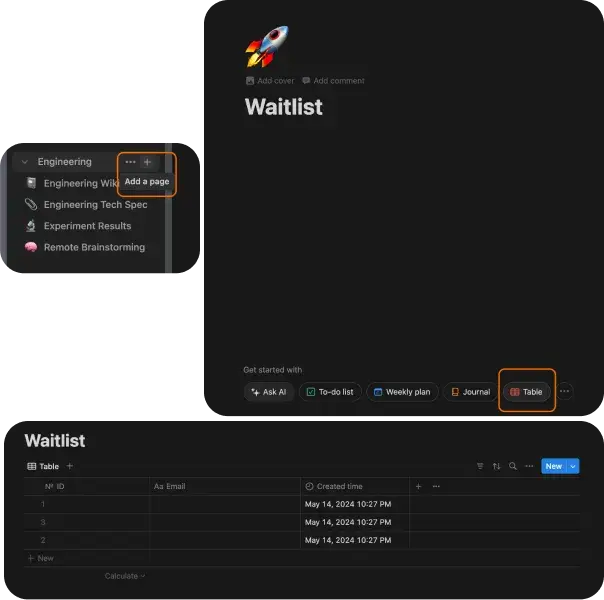
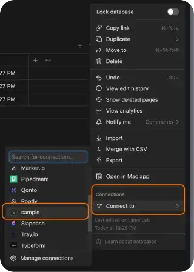

This tutorial is backed by open source code. Find the complete source code in our [GitHub repository](https://github.com/SHSFWork/notion-nextjs-waitlist-starter-kit). The code is open source and available for everyone to use.

## Headings

- How to create a database in Notion?
- How to create Notion integration and secret authentication?
- How to connect integration with the database?
- How to add an internal integration secret and Database ID?
- What is Notionhq Client Package?
- How to perform a Notion API post-operation with Next.js App Router?
- How to write a POST service within API Route?
- How to send a request to the POST service?

## How to Create a Database in Notion?

Add a page and then create a table within the page.

You're free to manage the fields within the table as you wish. In this write-up, I'll focus on ID, email, and created time fields.



## How to Create Notion Integration and Secret Authentication?

You can click here for Notion API documentation and integration.

Go to your integrations page, sign in to your Notion account, and then create a new integration.

You can add a name and logo for your integration. I'll use a sample integration for this write-up.

After this step, you'll be presented with an internal integration secret. We'll add this key to the env file of our project.

## How to Connect Integration with the Database?

Go back to the waitlist table you created in Notion. From the menu that appears on the top left, select the integration you created through "connect to." That's all there is to it.



## How to Add Internal Integration Secret and Database ID?

While creating the integration, give the key a name as you wish and add it to the env file. (E.g., NOTION_SECRET_AUTH) This key will be used in the Notion client.

Go to the waitlist database where you linked the integration. Click on "share" in the top left corner and click "copy link." It will give you a link like the one below, and you just need to get the DATABASE_ID.

```
https://www.notion.so/[notion_name]/[DATABASE_ID]?v=[numbers]&pvs=[numbers]
```

You can add it to the .env file like this: NOTION_WAITLIST_DATABASE_ID

## What is Notionhq Client Package?

The @notionhq/client package is a simple and easy-to-use client for the Notion API. I'll use this package since it's recommended in the documentation.

## How do you perform a Notion API Post Operation with Next.js App Router?

Create a folder named API under the app folder.

To maintain consistency, I'll use the following folder structure in subsequent sections:

```
— app
— — API
—— — notion
— — — — waitlist
—— — — — route.ts
```

In the route.ts file, write a post service using the @notionhq/client package.

## How to Write a POST Service within an API Route?

We'll use the NOTION_SECRET_AUTH and NOTION_WAITLIST_DATABASE_ID we added to .env.production with the @notionhq/client package.

```javascript
import { Client } from "@notionhq/client";
import { NextResponse } from "next/server";

export async function POST(request: Request) {
  const body = await request.json();
  try {
    const notion = new Client({ auth: process.env.NOTION_SECRET_AUTH });
    const response = await notion.pages.create({
      parent: {
        database_id: process.env.NOTION_WAITLIST_DATABASE_ID,
      },
      properties: {
        Email: {
          title: [
            {
              text: {
                content: body?.email,
              },
            },
          ],
        },
      },
    });
    return NextResponse.json({ success: true }, { status: 200 });
  } catch (error) {
    return NextResponse.json({ success: false }, { status: 500 });
  }
}
```

Email is a field we added to our table. Since it's a title and rich text, this is the basic usage. For more detailed database properties, refer to.

## How to Send a Request to the POST Service?

Since this series of articles is the first part of a whole, I'll use Axios.

```javascript
const onSubmit = async (data: z.infer<typeof FormSchema>) => {
  try {
    await axios.post("/api/notion/waitlist", {
      email: data.email,
    });

    form.reset();
    toast({
      title: "Welcome 🎊",
      description: "toast msg",
    });
  } catch (error) {
    toast({
      variant: "destructive",
      title: "Oops! Something went wrong",
      description: "Please try again later.",
    });
  }
};
```

Note: We're sending the request based on the folder structure we created under App: /api/notion/waitlist

In addition to the request, toast and form components are used. You only need to focus on the Axios operation.

With this process, a row with ID, email, and created time will be added to your database.
