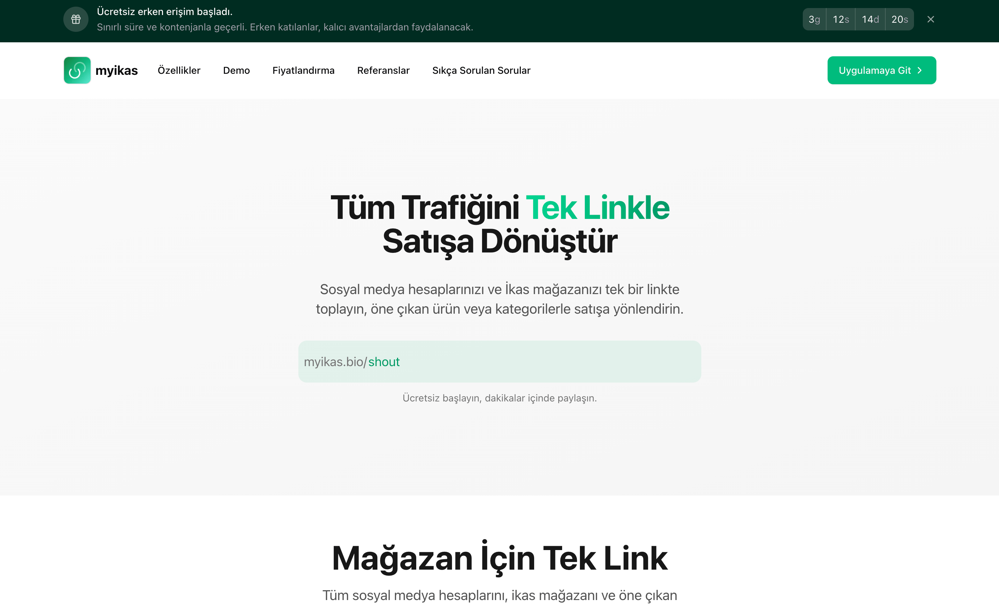
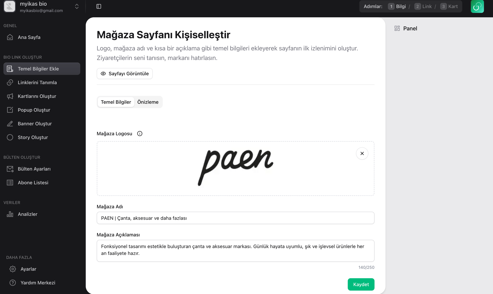
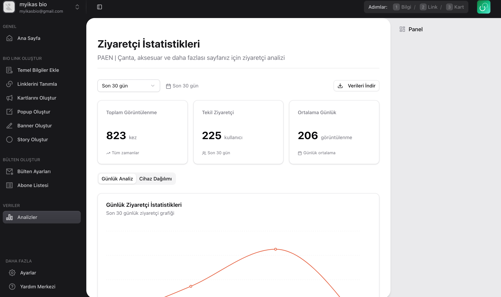
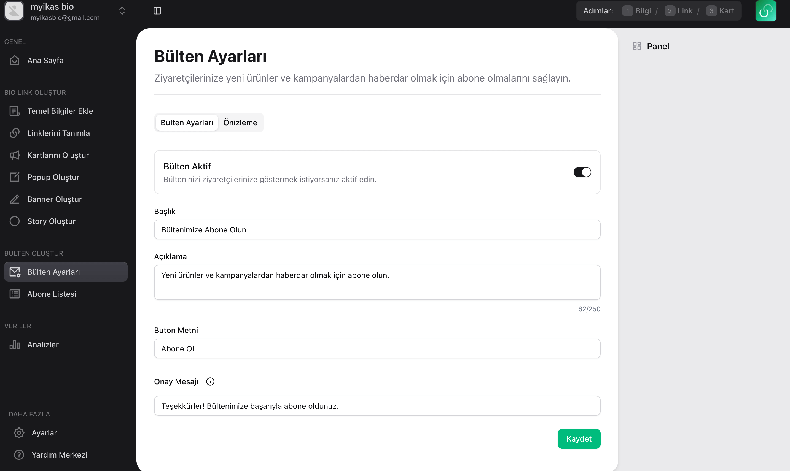
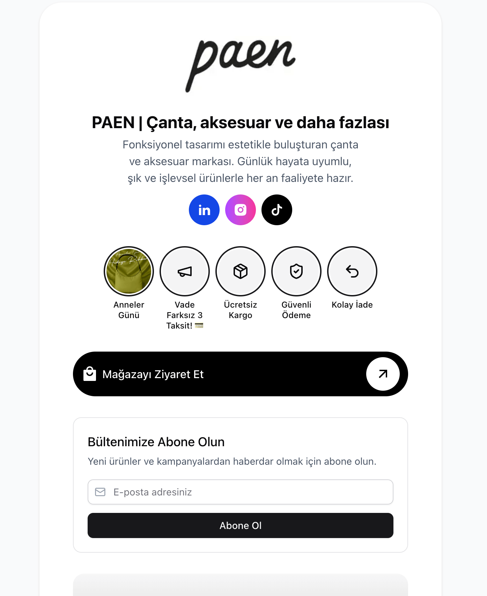

Myikas is a smart bio link platform tailored for ikas store owners to convert social traffic into sales effortlessly. Bring together all your social profiles, highlight key products, and drive engagement—all from a single link.

## Key Features

- **All-in-One Bio Link**  
  Combine your ikas store and all social media accounts into a single, customizable link.

- **Highlight Products**  
  Show off your top products with stylish, clickable cards complete with images, titles, and CTA buttons.

- **Story**  
  Share product updates, campaigns, or content in Instagram-style stories to engage visitors instantly.

- **Banner**  
  Display full-width banners for promotions, announcements, or brand messaging with complete customization.

- **Visitor Analytics**  
  Track page performance by device, date, and unique visitors. Export data as CSV.

- **Popup Promotions**  
  Greet visitors with personalized popups for discounts, announcements, or email collection.

- **Email Subscriptions**  
  Collect emails with built-in newsletter forms and export your subscriber list anytime.

- **Quick Setup**  
  Get started in under 5 minutes with an intuitive, no-code interface.

- **Mobile Ready**  
  Fully responsive design optimized for both desktop and mobile devices.

## Tech Stack

Myikas is built using the following technologies:

1. **Next.js**
2. **TypeScript**
3. **Tailwind CSS**
4. **Supabase**

## Visual Showcase

- **Landing Interface:** Your store and socials in one smart link. 
- **App Dashboard:** Create, customize, and launch your page. 
- **Analytics View:** Track visits, devices, and user insights. 
- **Newsletter Module:** Capture leads and build your audience. 
- **Demo:** 

## Supporting Myikas

Support Myikas and empower ikas sellers to convert their audience into customers.

Visit [myikas.bio](https://www.myikas.bio) to explore and build your page today.
