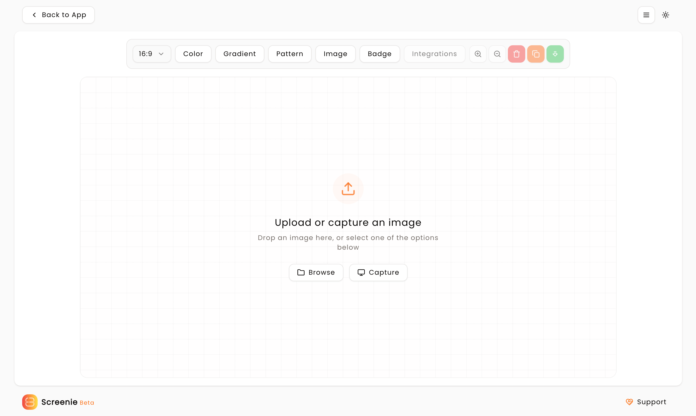

Screenie is a comprehensive platform that revolutionizes your visual creation process. Capture flawless screenshots or instantly generate stunning logos, avatars, headers, and more—all in seconds. With an intuitive interface and powerful tools, Screenie empowers users to create professional visuals without the complexity of traditional design software. The platform offers both free and premium features, making it accessible to individual creators and teams alike.

## Key Features

- **Instant Screenshot Capture:** Take perfect screenshots with customizable borders, shadows, and backgrounds.
- **Customization Options:** Extensive settings for both captured screenshots and generated visuals.
- **One-Click Sharing:** Export your creations directly to social media or copy to clipboard instantly.

## Tech Stack

Screenie is built using the following technologies:

1. **Next.js**
2. **TypeScript**
3. **Tailwind CSS**
4. **Redux.js**
5. **RTK**
6. **Content Collections**
7. **Vercel**

## Visual Showcase

- **Home Interface:** Welcoming landing page with feature highlights and quick access. 
- **App Dashboard:** Powerful screenshot capture and management interface. 
- **Studio Environment:** Advanced visual design and generation tools. 

## Supporting Screenie

Support Screenie and its mission to make visual creation accessible to everyone:

Visit [screenie.me](https://www.screenie.me) to explore and create stunning visuals today.
