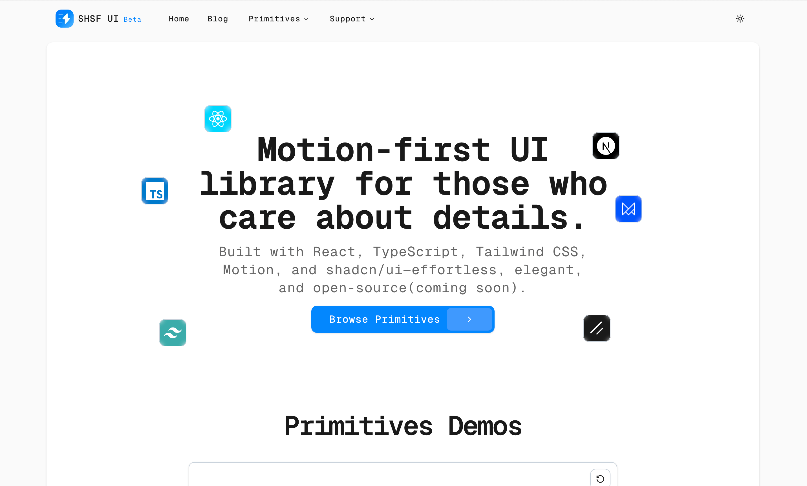
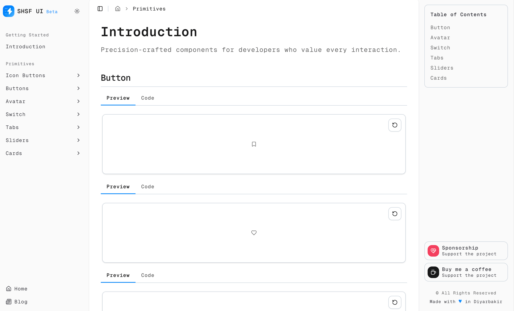
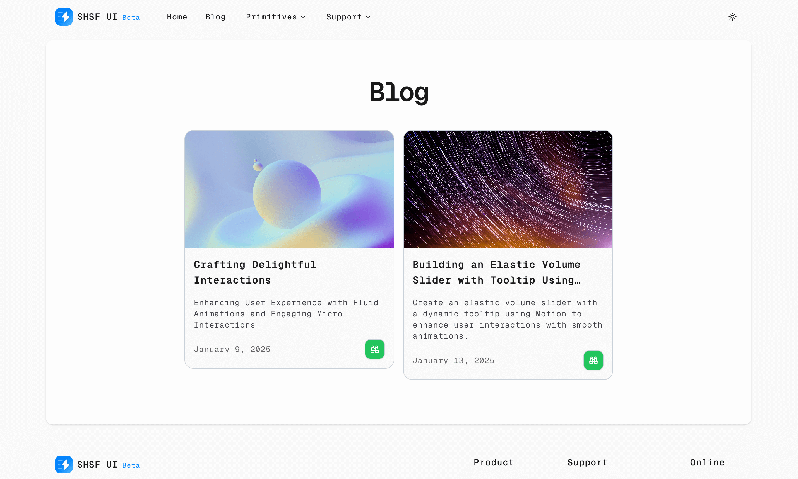

SHSF UI is a motion-first UI library designed for design enthusiasts who want to revolutionize their web development process. Built with React, TypeScript, Tailwind CSS, Framer Motion, and shadcn/ui, it offers elegant, detailed components that prioritize animation and interactivity. With a strong open-source commitment, SHSF UI is set to transform how developers implement sophisticated UI components through community contributions and continuous improvement.

## Key Features

- **Motion-first Design:** Elegant, detailed components with built-in animation capabilities.
- **React Components:** Professionally crafted UI elements built with React and TypeScript.
- **Design Enthusiast Focus:** Specifically designed for developers who prioritize aesthetic excellence.
- **Open Source Commitment:** Soon to be released to the community for contributions and improvement.
- **Developer Experience:** Fully typed components with comprehensive documentation.

## Tech Stack

SHSF UI is built using the following technologies:

1. **Next.js**
2. **TypeScript**
3. **Tailwind CSS**
4. **Framer Motion**
5. **shadcn/ui**

## Visual Showcase

- **Home Interface:** The main dashboard showing component categories and documentation.
  

- **Primitives Gallery:** Core UI building blocks with motion capabilities.
  

- **Guide Interface:** Articles and tutorials section demonstrating implementation examples.
  

## Supporting SHSF UI

Support this UI library and its mission to enhance web development with motion-first components:

Visit [shsfui.com](https://shsfui.com) to explore and contribute to the upcoming open-source release.
