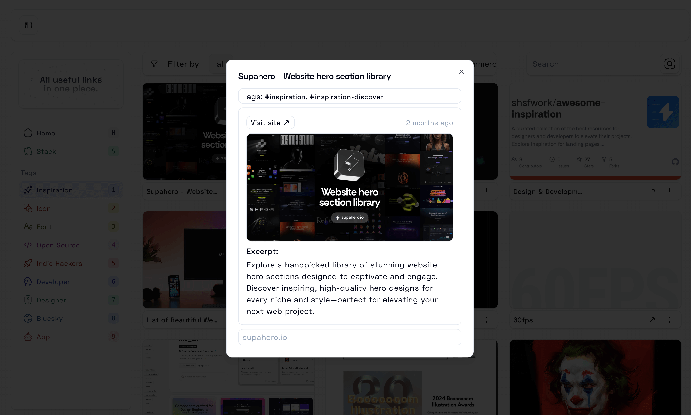
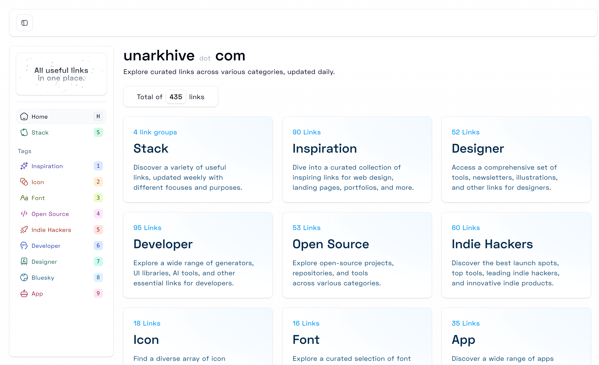
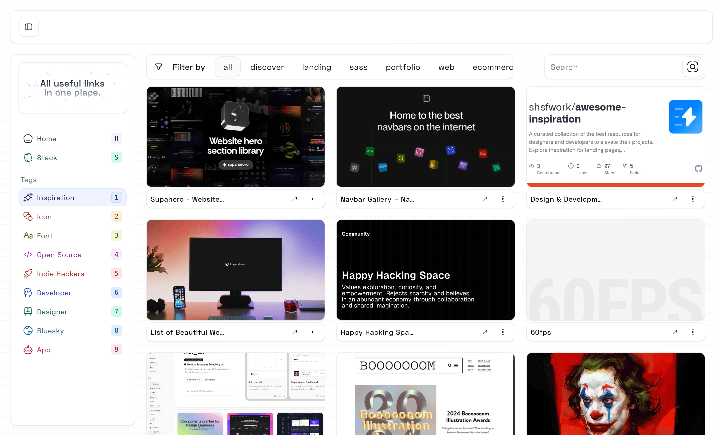
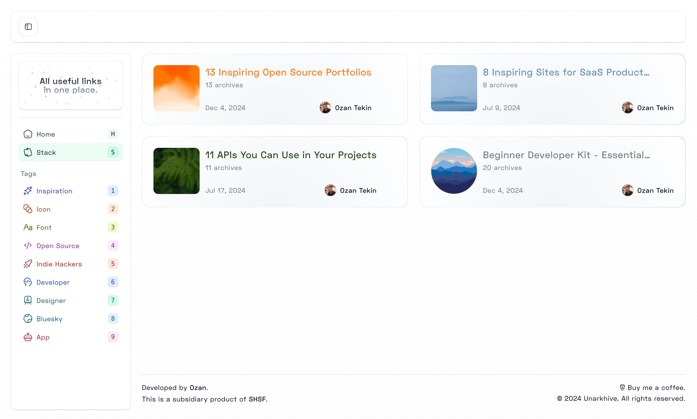
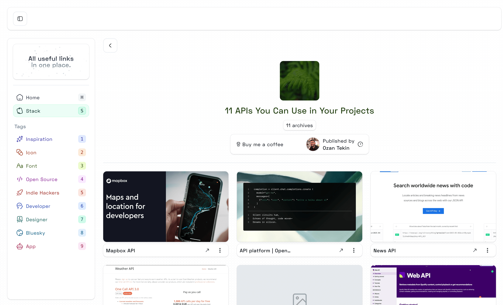

Unarkhive is a comprehensive platform that brings together 400+ carefully curated links across 9 distinct categories, helping users find inspiration, tools, and resources for their personal and professional projects. With a clean, minimalist design, Unarkhive offers daily updates, ensuring relevance and freshness. It is a subsidiary product of [SHSF](/) and developed by [Ozan](https://ozantek.in), reflecting a passion for curation and accessibility.

## Key Features

- **Stack:** Weekly updates featuring links tailored for varied purposes.
- **Inspiration:** A creative hub showcasing ideas for web design, landing pages, and portfolios.
- **Icon & Font:** Collections of icon packs and typography tools for creative professionals.
- **Developer & Designer:** Extensive resources, including developer tools, designer assets, newsletters, illustrations, and generators.
- **Open Source:** A list of open-source repositories, tools, and projects.
- **Indie Hackers:** Spotlighting tools and success stories from the indie hacking community.
- **App:** Productivity tools and apps for desktop and mobile.
- **Bluesky:** A growing collection of indie hacker products and innovations from the Bluesky ecosystem.

## Tech Stack

Unarkhive is built using the following technologies:

1. **Next.js**
2. **TypeScript**
3. **Tailwind CSS**
4. **Framer Motion**
5. **Raindrop API**

## Visual Showcase

- **Minimalist Card Design:**  
  A clean and modern card layout for category previews.  
  

- **Stunning Cover:**  
  A visually appealing cover that captures the essence of curated collections.  
  

- **List View:**  
  Displays categories with brief descriptions for easy navigation.  
  

- **Stack Category:**  
  Weekly updated links with a focus on diversity and relevance.  
  

- **Detailed Stack List:**  
  A deeper dive into the "Stack" category, showcasing a variety of curated links.  
  

## Supporting Unarkhive

Support Unarkhive and its mission to curate the web’s most useful links:

Visit [unarkhive.com](https://www.unarkhive.com) to explore and contribute.
